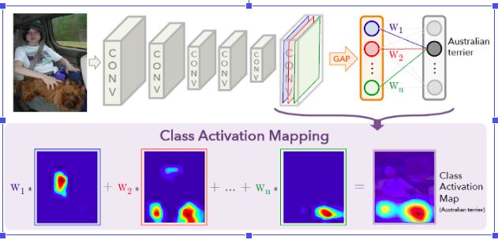

# Class-Activation-Maps
This repo contains code for CAM in CNN.

## Overview
In the case of CNN’s various visualization techniques have been discovered and one of them is Class Activation Maps (CAM).
Class Activation Maps or CAM which was introduced in the paper Learning Deep Features for Discriminative Localization by using the Global Average Pooling in CNNs. A Class Activation map for a particular category indicates the discriminative region used by CNN to identify the category.
A CAM is a weighted activation map generated for each image [1]. It helps to identify the region a CNN is looking at while classifying an image. CAMs aren’t trained supervised, but in a weakly supervised fashion. This means, that the objects do not have to be labeled manually and the localization is kind of learned for “free”. 

The only thing that has to be changed on the architecture is to get rid of the fully connected dense layers at the end in order to maintain the spatial information contained in the output of the last convolution layer. In addition, a global average pooling layer is added afterwards. This layer is usually used for regularization in order to prevent the network from overfitting [2]. Finally, the output softmax layer with as many neurons as classes to classify (in our case: 131) is added. Figure 2 summarizes the required architecture and shows how to compute the CAM.

## Conclusion
As one can see, the CAM can be easily computed by just making little adjustments to the network architecture and comes for free, so no one has to expensively label the data. Also, the CAM can be used for debugging, because one can see on which area of the image the network is focusing on. This could be helpful if, for example, the network is supposed to classify the presence of a harbor in the image and by plotting the CAM it gets clear that the network is focusing on the sky and not on the harbor itself. Then the user could adapt the dataset to also contain images of harbors without a visible sky and therefore avoid such wrong correlations.

CAMs are a great way to see what your CNN models are seeing while they are training and offers insights to the developer as well as the stakeholder which can be very crucial to the model’s usability and lifecycle. By the help of the CAMs the developer can see which region in the image the model was looking at and can be used to examine the reasons for bias in the model, lack of generalizing power or many other reasons which when fixed can make the model more robust and deployable in the real world.
