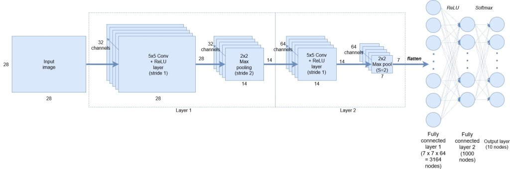
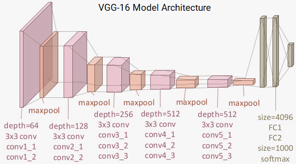

Following is a repository on implementing CNN via transfer learning and a small architecture respectively.

# Convolutional-Networks
A Convolutional Neural Network (CNN) is comprised of one or more convolutional layers (often with a subsampling step) and then followed by one or more fully connected layers as in a standard multilayer neural network. The architecture of a CNN is designed to take advantage of the 2D structure of an input image (or other 2D input such as a speech signal). This is achieved with local connections and tied weights followed by some form of pooling which results in translation invariant features. Another benefit of CNNs is that they are easier to train and have many fewer parameters than fully connected networks with the same number of hidden units.

### Transfer Learning
Transfer learning is a machine learning method where a model developed for a task is reused as the starting point for a model on a second task.
It is a popular approach in deep learning where pre-trained models are used as the starting point on computer vision and natural language processing tasks given the vast compute and time resources required to develop neural network models on these problems and from the huge jumps in skill that they provide on related problems.We will use VGG16 pretrained on imagnet dataset.Here is an image of it's architecture. 

